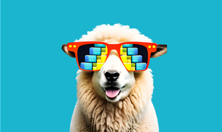

# Databricks - Professional Certificate in large language models

> **Note** This repository has all course notes and lab notebooks I used while
> completing the profesional certificate in large language models by Databricks
> academy on
> [edX](https://www.edx.org/professional-certificate/databricks-large-language-models?index=product&queryID=7df500f9b5a730d93a39b45d143b9bb4&position=6&linked_from=autocomplete&c=autocomplete).

## TL; DR: What Was Learned

* How to apply LLMs to real-world problems in natural language processing using
  popular libraries, such as Hugging Face and LangChain.
* How to build a custom chat model leveraging open-source LLMs.
* Understand the theory behind foundation models, how to fine-tune foundation
  models on custom datasets, and the innovations that led to GPT-4 and ChatGPT.
* How to implement LLMOps and multi-step reasoning best practices.
* How to evaluate the efficacy and bias of LLMs using different methods.

## Two Courses In Program

[Databricks LLM101x - Large Language Models: Application through Production](https://www.edx.org/course/large-language-models-application-through-production)

| :---: | :--- |
|  | This course is aimed at developers, data scientists, and engineers looking to build LLM-centric applications with the latest and most popular frameworks. By the end of this course, you will have built an end-to-end LLM workflow that is ready for production! |

[Large Language Models: Foundation Models From The Ground Up](https://www.edx.org/course/large-language-models-foundation-models-from-the-ground-up)

| :---: | :--- |
|  | This course dives into the details of foundation models in natural language processing (NLP). You will learn the innovations that led to the proliferation of transformer-based models, including BERT, GPT, and T5, and the key breakthroughs that led to applications such as ChatGPT. |

   

## Program Overview

As Large Language Model (LLM) applications disrupt countless industries,
breakthroughs such as ChatGPT are becoming household terms. The demand for
LLM-based applications is skyrocketing, and this program will provide you with
the skills and knowledge needed to be at the forefront of this exciting field.
You will learn how you can build your own production-ready LLM-based
applications, leveraging the latest and most popular natural language
processing (NLP) frameworks.

Brought to you by the big data company that created the popular open-source
projects Apache Spark, MLflow, Delta, and Dolly, the instructors bring a unique
perspective from working with F500 companies, startups, and academia.

The first course takes you through a practical tour of how to get started
quickly with LLMs for common applications, including fine-tuning open-source
LLMs to build your own custom chat model. You will also learn how to apply
LLMOps best practices for deploying models at scale, as well as evaluate the
efficacy and bias of LLMs.

The second course dives into the details of language foundation models. You
will learn the innovations that led from LSTMs to Transformers, including BERT,
GPT, and T5, and the key breakthroughs that led to the model powering ChatGPT.

By the end of the program, you will have built your own end-to-end LLM
workflows that are ready for production. Upon completion, you will be
well-equipped to pursue careers as LLM developers, data scientists, and
engineers, and to build innovative solutions to complex natural language
processing problems.
